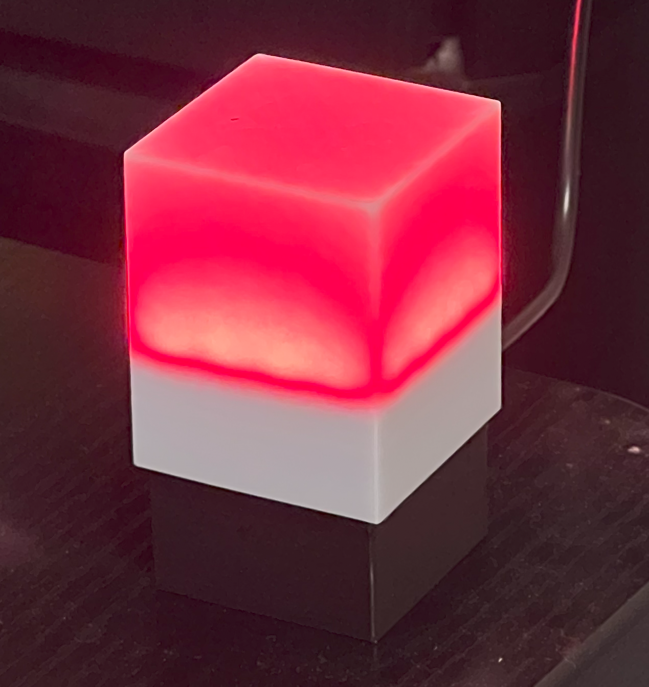
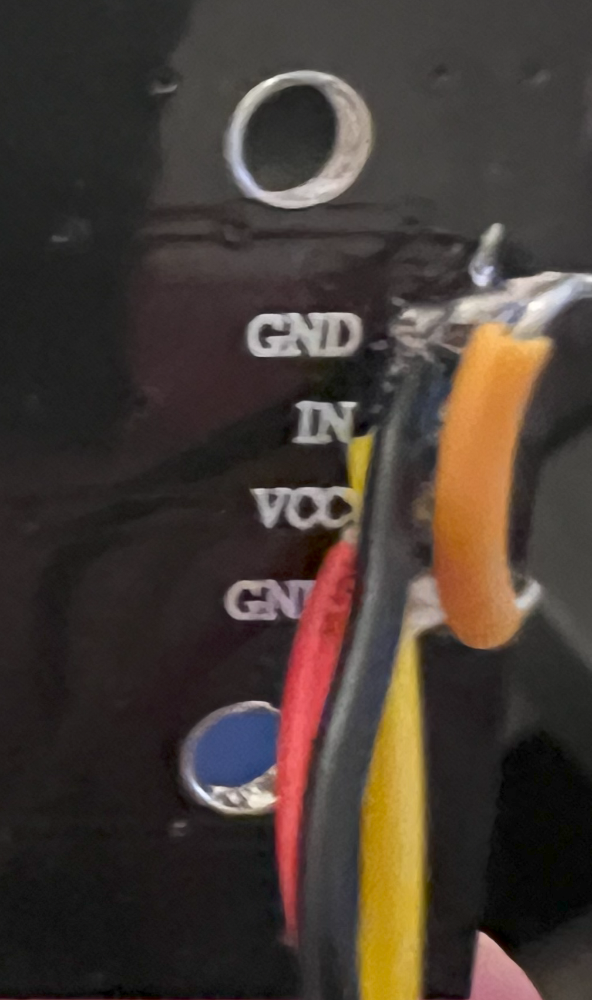

# Teams Status Light - Firmware and 3D Models

## Helper Application for Windows

Code for the TeamsStatusLight WPF application [Here](https://github.com/jublin/TeamsStatusWPF)

## Parts needed:

The LED Matrix I have used can be found on [AliExpress](https://www.aliexpress.us/item/3256806834627585.html) (No affiliate link)

I used this RPi2040 Pico-Zero, also on [AliExpress](https://www.aliexpress.us/item/3256804095235134.html) (No affiliate link)

JST-PH (2.0mm pitch) 0 2 2-pin connector sets (pcb and wire) [Amazon](https://www.amazon.com/gp/product/B09DBHG6NW/)

Feel free to modify as you wish. F360/Step Files included. 

## Flashing

For PlatformIO, the driver for the board must be loaded using [ZaDig](https://zadig.akeo.ie/]) (see [this GitHub isue](https://github.com/platformio/platform-raspberrypi/issues/2#issuecomment-828586398)).

I've copied the file contents to an Arduino Sketch as well. To use the board in Arduino - see the instructions [here](https://www.waveshare.com/wiki/RP2040-Zero)

You will need to add the board package list to Arduino package manager: https://github.com/earlephilhower/arduino-pico/releases/download/global/package_rp2040_index.json

## Assembly

Soldier in the 2 connectors on the RPi Pico Zero. You will need the 5V/Gnd, and I chose pins 15 for the LED (other pin isn't used).

Soldier in at least the back header pins. I also put them on each side. 

Insert the Rpi Pico Zero into the bottom part. It will be a tight fit with the pins, but they keep it in place when inserting/removing the USB-C cable. The RP2040 chip will be face down. 

Solder the VCC/Gnd connector wires to the back of the matrix. Solder the seconds ground with a jumper of any sort. 

Solder the last wire (data in) to the other PH connector wire. 

Add M3x4mm threaded inserts to the four corners in the pico holder section. 

Feed the PH connectors through the center hole of the matrix holder, and insert them into the connectors on the pico. 

Leave the matrix unscrewed while screwing in the screws for connecting the matrix and pico holders.

The leftover wires will be just left pushed into the pico holder. After that, the matric can be screwed down with any short 3mm screws. I had some short self-tapping ones [these.](https://www.amazon.com/gp/product/B07DLWSQD5/1)

Slide the led cover over. It's just loose enough to allow for an easy slide, but won't fall off. 

You're done!

