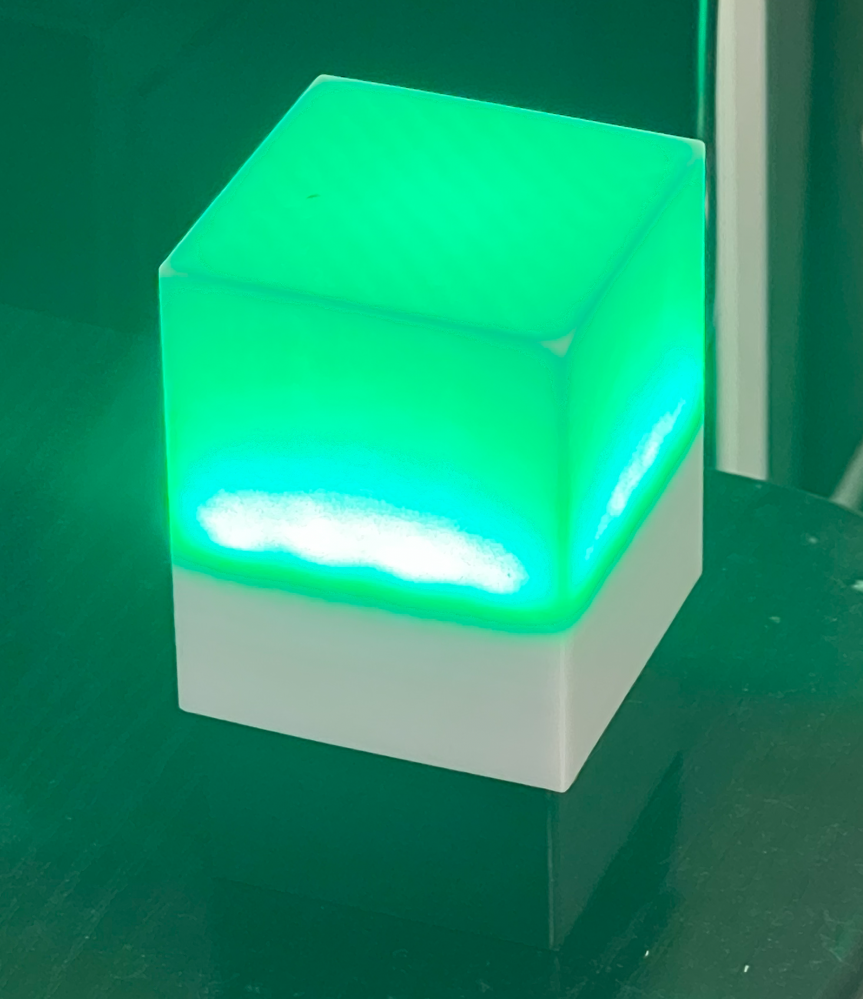
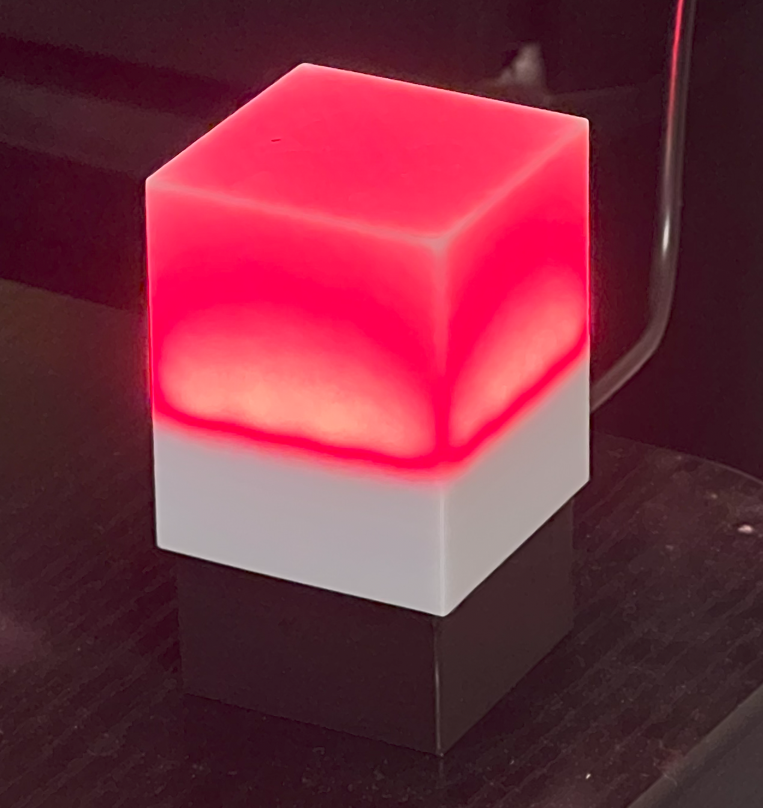
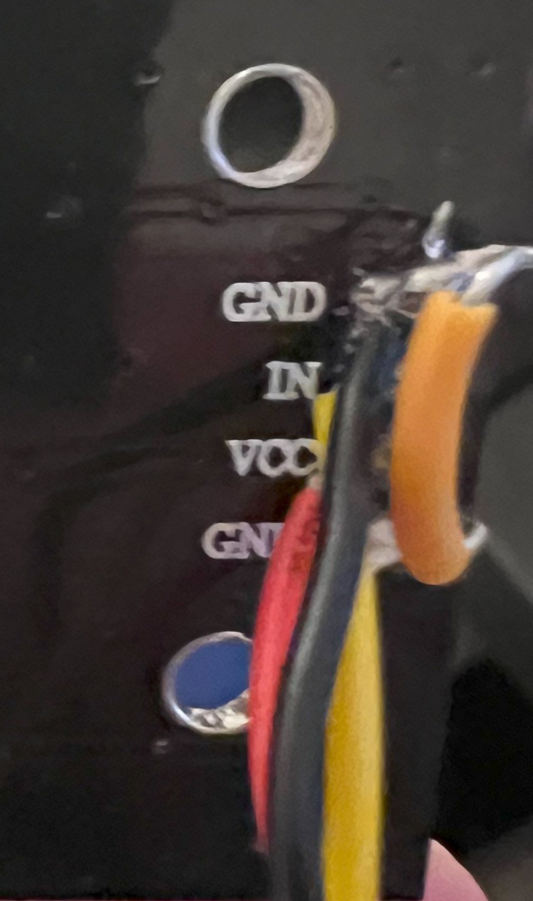

# Teams Status Light - Firmware and 3D Models



## Helper Application for Windows

Code for the TeamsStatusLight WPF application [Here](https://github.com/jublin/TeamsStatusWPF)

## Status notifier features

The firmware supports configurable colors for `available`, `busy`, `away`, `dnd`
(do not disturb), and `offline`. Each preset can be steady, blink, or pulse, with
an adjustable period. Global brightness, lights-off mode, temporary notifications,
and an optional stale-connection timeout are built in. The portable Status Light
companion configures this firmware over the USB protocol below.

Defaults are green, red, amber, purple, and black respectively, all steady.
Brightness starts at 255 to preserve existing RGB behavior; try 64 for a dimmer
desk light. The device starts dark until a status or RGB color arrives. Saved
settings load at startup, but the last displayed status is never restored.

### USB serial protocol (version 1)

Open the port with 8 data bits, no parity, one stop bit, and no hardware flow
control. Enable DTR so replies can be received.

- **9600 or 115200 baud:** existing binary RGB protocol. Send exactly three bytes
  (red, green, blue), without a newline. All byte values remain valid; complete
  triples update the light, and an incomplete triple expires after one second
  without another byte. There are no replies in this mode.
- **57600 baud:** companion-app command protocol. Send the ASCII commands below,
  one per line, terminated by LF or CRLF. Baud is a USB mode selector, not a
  physical transmission speed. Other rates select RGB mode; avoid 1200, which
  the board core reserves for flashing.

Change modes only between messages, after draining the serial buffers. Changing
mode discards an incomplete message and cancels any temporary notification.
For a command-mode reconnect, send a newline and drain its response before `GET`
to clear any abandoned partial line. Do not let two apps own the port at once.

Commands are case-sensitive; status and effect names are lowercase. Numeric
arguments are unsigned decimal integers. A command line has a maximum of 95
characters (excluding CR/LF). Invalid, oversized, or non-ASCII lines return
`ERR command` without changing settings; the parser recovers at the next LF.
Blank lines have no response. Successful commands return `OK`; `SAVE` can return
`ERR storage`. `GET` returns the fields shown below, followed by `OK`.
Send one command and read its complete reply before sending another.

| Command | Behavior |
| --- | --- |
| `GET` | Return protocol version, settings, current status, and stale flag. |
| `STATUS busy` | Select a preset and refresh the status heartbeat. |
| `PRESET busy 255 0 0 pulse 2000` | Set RGB (0–255 each), effect (`steady`, `blink`, `pulse`), and period in milliseconds (100–60000). Changes apply immediately. |
| `BRIGHTNESS 64` | Set global brightness (0–255), including notifications and legacy RGB. |
| `OFF` / `ON` | Hide/show the light while continuing to track status. Status messages do not undo `OFF`. |
| `NOTIFY 0 100 255 blink 500 3000` | Show RGB/effect/period for a duration in milliseconds (1–600000), then return to the latest status. A new notification replaces the old one. |
| `CLEAR` | Cancel the temporary notification. |
| `TIMEOUT 30` | After this many seconds without `STATUS`, a complete RGB triple, or `PING`, display the `offline` preset. Range 0–86400; 0 disables timeout (the default). |
| `PING` | Refresh the heartbeat and clear stale state. Does not create an initial status. |
| `SAVE` | Explicitly persist presets, brightness, and timeout across power cycles. |
| `DEFAULTS` | Restore default presets, brightness, and timeout in memory. Send `SAVE` to persist the reset. |

Example session at **57600 baud** (wait for `OK` after each command):

```text
PRESET busy 255 40 0 steady 1000
PRESET dnd 160 0 255 pulse 2000
BRIGHTNESS 64
TIMEOUT 30
SAVE
STATUS busy
NOTIFY 0 100 255 blink 500 3000
```

With a 30-second timeout, the companion should send `PING` or `STATUS` about
every 10 seconds while its status source is healthy. Configuration commands and
notifications do not refresh the heartbeat. A stale connection overrides a
notification; `OFF` overrides all output. Without a base status, a notification
returns to darkness when it expires. Blink spends half its period on; pulse ramps
linearly from dark to full color and back.

Example `GET` response with default settings after `STATUS busy`:

```text
INFO 1
BRIGHTNESS 255
TIMEOUT 0
ENABLED 1
STATUS busy
STALE 0
PRESET available 0 255 0 steady 1000
PRESET busy 255 0 0 steady 1000
PRESET away 255 160 0 steady 1000
PRESET dnd 180 0 255 steady 1000
PRESET offline 0 0 0 steady 1000
OK
```

`STATUS` reports the underlying status (`none` before the first update, `rgb` for
legacy input), even during a notification, stale state, or lights-off mode.
Settings change in RAM until `SAVE`; save once after editing rather than on every
slider movement. Storage records include a version and checksum, and invalid
records fall back to defaults. PlatformIO uses the Mbed core's KVStore; the
Arduino-Pico core uses its [flash-backed EEPROM](https://arduino-pico.readthedocs.io/en/latest/eeprom.html).
An interrupted flash write can lose saved settings; ordinary status updates never
write flash. Runtime status, notifications, and `OFF` are not persisted.

### Build and checks

```sh
pio run
g++ -std=c++11 -Wall -Wextra -Werror -fsanitize=address,undefined test/notifier.cpp -o /tmp/teamslight-test
/tmp/teamslight-test
python3 test/firmware.py
```

The host check covers fragmented RGB, malformed commands, brightness/effects,
notification expiry, timeout/heartbeat behavior, timer wraparound, and settings
validation. Verify LED colors, USB mode selection, and `SAVE` followed by a power
cycle on the actual board before relying on it.
The firmware-loop check also simulates a stalled USB reader, partial replies,
and storage success/failure while running the real firmware loop.

Both entry points share `Firmware.h` and `StatusLight.h`. For the Arduino IDE,
place `TeamsLight.ino` and those two headers in a folder named `TeamsLight`, select
the Waveshare RP2040 Zero board from the Earle Philhower Arduino-Pico package,
use the default **Pico SDK** USB stack, and install **Adafruit NeoPixel 1.12.3**.
The library is pinned because newer releases use PIO APIs absent from the Mbed
SDK used by this PlatformIO project. `LED_PIN` (default 15) and `LED_COUNT`
(default 16) can be overridden at build time for different wiring.

## Parts needed:

### Round domed enclosure option

The [Blender enclosure generator](3DModels/blender/README.md) creates a 56 mm
diameter, 49.5 mm tall round enclosure with integrated LED mounts, a removable
Pico service bottom, and a dome. It replaces the square printed holders while
retaining the electronics' mounting interfaces. The script, generated Blender
assembly, STL files, and previews are included.

The LED Matrix I have used can be found on [AliExpress](https://www.aliexpress.us/item/3256806834627585.html) (No affiliate link)

I used this RPi2040 Pico-Zero, also on [AliExpress](https://www.aliexpress.us/item/3256804095235134.html) (No affiliate link)

JST-PH (2.0mm pitch) 0 2 2-pin connector sets (pcb and wire) [Amazon](https://www.amazon.com/gp/product/B09DBHG6NW/)

Feel free to modify as you wish. F360/Step Files included. 

## Flashing

For PlatformIO, the driver for the board must be loaded using [ZaDig](https://zadig.akeo.ie/]) (see [this GitHub isue](https://github.com/platformio/platform-raspberrypi/issues/2#issuecomment-828586398)).

The Arduino sketch uses the same firmware headers as PlatformIO; see the build
instructions above. Board setup instructions are available [here](https://www.waveshare.com/wiki/RP2040-Zero).

You will need to add the board package list to Arduino package manager: https://github.com/earlephilhower/arduino-Pico/releases/download/global/package_rp2040_index.json


## Assembly

Soldier in the 2 connectors on the RPi Pico Zero. You will need the 5V/Gnd, and I chose pins 15 for the LED (other pin isn't used).

Soldier in at least the back header pins. I also put them on each side. 

Insert the Rpi Pico Zero into the bottom part. It will be a tight fit with the pins, but they keep it in place when inserting/removing the USB-C cable. The RP2040 chip will be face down. 


Solder the VCC/Gnd connector wires to the back of the matrix. Solder the seconds ground with a jumper of any sort. 

Solder the last wire (data in) to the other PH connector wire. 



Add M3x4mm threaded inserts to the four corners in the Pico holder section. 

Feed the PH connectors through the center hole of the matrix holder, and insert them into the connectors on the Pico. 

Leave the matrix unscrewed while screwing in the screws for connecting the matrix and Pico holders.

The leftover wires will be just left pushed into the Pico holder. After that, the matrix can be screwed down with any short 3mm screws. I had some short self-tapping ones [these.](https://www.amazon.com/gp/product/B07DLWSQD5/1)


Slide the led cover over. It's just loose enough to allow for an easy slide, but won't fall off. 


You're done!


